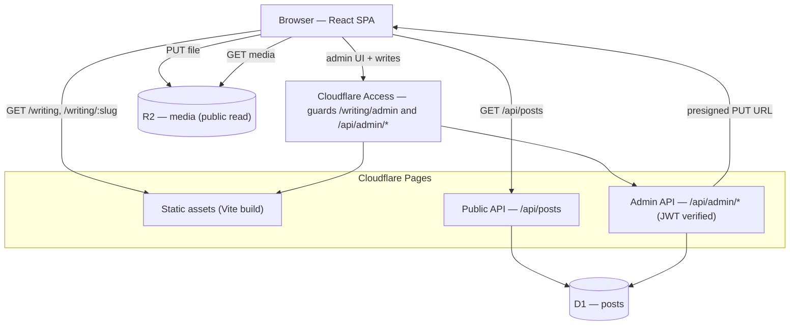
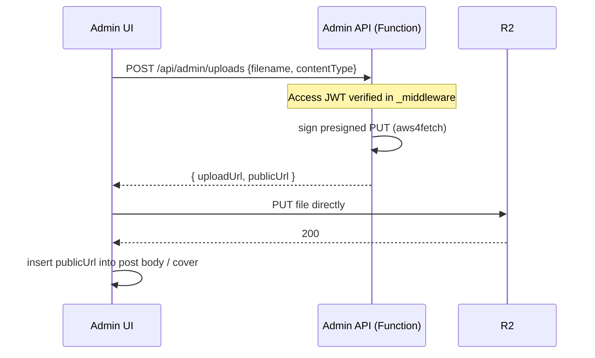

# feat: Blog system on Cloudflare (D1, R2, Pages Functions)

## Summary

Add a dynamic blog at `/writing` to the existing static portfolio. A single
author writes markdown through a Cloudflare Access–protected admin in the React
app, picks one of three preset layouts, and uploads images and short videos.
Posts live in D1, media in R2, served by thin Pages Functions; the public site
renders markdown with `react-markdown`. The site stays on Cloudflare Pages.

This plan builds the backend foundation first, then the authoring API and admin
UI, then the public rendering surface. Testing uses Vitest + React Testing
Library across backend logic and components (see origin: `docs/brainstorms/2026-06-24-blog-system-requirements.md`).

---

## Problem Frame

The site (`src/`) is a fully static React + Vite SPA with no backend; content is
fetched at runtime from `public/data/portfolio.json`. There is no database, no
Functions directory, and no `wrangler` config (confirmed by repo scan). The
author wants to publish from any device without a code edit or rebuild per post,
which requires a small backend. This plan adds that backend Cloudflare-natively
and wires the public and admin surfaces into the existing SPA without disturbing
the current pages.

---

## Requirements Traceability

All requirements carry over from the origin document. Each maps to the unit(s)
that satisfy it.

| Origin R-ID | Requirement (abbrev.) | Units |
|---|---|---|
| R1 | Author CRUD posts via admin UI | U5, U8 |
| R2 | Admin at a dedicated route, not in public nav | U8 |
| R3 | Markdown editor with live preview | U8 |
| R4 | Post metadata: title, slug, cover, date, template, status | U2, U5, U8 |
| R5 | Saving persists without rebuild | U5 |
| R6 | Render markdown at runtime (gfm, highlight, sanitized) | U6 |
| R7 | One of three preset layout templates | U6 |
| R8 | No MDX; content never executes code | U6 |
| R9 | Upload images/short video; browser→R2 via presigned URL | U5, U8 |
| R10 | Media referenced by stable public URLs | U2, U5 |
| R11 | Video served as raw R2 files via `<video>` | U6 |
| R12 | Public index at `/writing`, newest first | U4, U7 |
| R13 | Posts at `/writing/<slug>` | U4, U7 |
| R14 | Drafts never public or URL-guessable | U4, U7 |
| R15 | Admin route + write API behind Cloudflare Access | U2, U3 |
| R16 | Backend verifies Access JWT per write request | U3 |
| R17 | Stay on Pages; backend as Functions bound to D1 + R2 | U2 |

---

## Key Technical Decisions

- **Pages Functions over a standalone Worker.** The site is already a Pages
  project, so a `functions/` directory gives a same-origin `/api/*` with no
  hosting migration. A standalone Worker was the alternative (see Alternatives).

- **`react-markdown` at runtime, sanitized; templates are React wrappers.**
  Content is stored markdown and rendered client-side with `react-markdown` +
  `remark-gfm` + a syntax highlighter, with `rehype-sanitize` applied so stored
  HTML cannot execute. The `template` field selects a layout wrapper through a
  registry; the renderer is identical across templates. MDX is not used (R8).

- **Access JWT verified in an admin middleware.** A `_middleware` on the admin
  API validates the `Cf-Access-Jwt-Assertion` header with `jose`
  (`jwtVerify` + `createRemoteJWKSet` against `TEAM_DOMAIN`/`POLICY_AUD`), so the
  backend never assumes edge enforcement is present (R16). Public read routes are
  unauthenticated.

- **Local dev bypasses Access; full auth is verified on a deployed preview.**
  Cloudflare Access is an edge-only service and does **not** run under
  `wrangler pages dev` — locally there is no login and no `Cf-Access-Jwt-Assertion`
  header, so the middleware would 403 every request. The middleware therefore
  skips JWT verification when a dev env flag is set (injecting a fixed local
  identity); real Access verification is exercised against a deployed Pages
  preview with the Access application configured. The flag is dev-only and never
  set in production.

- **Uploads via presigned PUT direct to R2; reads via R2 public access.** The
  admin API issues a presigned PUT URL (`aws4fetch`) and the browser uploads
  straight to R2, so large files never stream through a Function. Media is read
  from R2 public access (custom domain or `r2.dev`) by stable URL. No media table
  in v1 — URLs are stored inline on the post.

- **Single `posts` table; `status` + `published_at` drive visibility.** The
  public API filters to `status = 'published'`; `slug` is the public key. One
  table is sufficient for v1.

- **Broad Vitest + React Testing Library coverage.** Backend pure logic (JWT
  verification, presign, slug, visibility filtering) and React components
  (renderer, templates, pages) are tested. This introduces the repo's first test
  runner.

---

## High-Level Technical Design

Component and request shape:



Media upload flow (presigned, file never transits a Function):



`posts` table shape (authoritative SQL lives in the migration, U2):

| Column | Type | Notes |
|---|---|---|
| `id` | TEXT PK | generated id |
| `slug` | TEXT UNIQUE NOT NULL | public key, `/writing/<slug>` |
| `title` | TEXT NOT NULL | |
| `body` | TEXT NOT NULL | markdown source |
| `template` | TEXT NOT NULL | `standard` \| `photo-essay` \| `video-forward` |
| `cover_image_url` | TEXT | nullable R2 public URL |
| `status` | TEXT NOT NULL | `draft` \| `published` |
| `published_at` | INTEGER | epoch ms, set on first publish |
| `created_at` | INTEGER NOT NULL | epoch ms |
| `updated_at` | INTEGER NOT NULL | epoch ms |

---

## Output Structure

New files cluster in three areas (existing files modified are noted per unit):

```
functions/
  api/
    posts/
      index.ts            # GET /api/posts
      [slug].ts           # GET /api/posts/:slug
    admin/
      _middleware.ts      # Access JWT verification
      posts/
        index.ts          # GET (all) + POST
        [id].ts           # GET + PUT + DELETE
      uploads.ts          # POST -> presigned PUT URL
  lib/
    auth.ts               # jose JWT verify helper
    presign.ts            # aws4fetch presigned PUT
    slug.ts               # slug generation + collision
    posts.ts              # D1 query helpers
migrations/
  0001_create_posts.sql
src/
  pages/
    Writing.tsx           # /writing index
    WritingPost.tsx       # /writing/:slug
    admin/
      AdminPosts.tsx      # list
      AdminEditor.tsx     # create/edit
  components/Blog/
    PostBody.tsx          # react-markdown renderer
    templates/
      StandardArticle.tsx
      PhotoEssay.tsx
      VideoForward.tsx
      index.ts            # template registry
  lib/blogApi.ts          # typed fetch wrappers
wrangler.toml             # bindings + pages dev
vitest.config.ts
src/test/setup.ts
```

The per-unit `**Files:**` lists are authoritative; this tree is the expected
shape, not a constraint.

---

## Implementation Units

### Phase A — Foundation

### U1. Test infrastructure (Vitest + React Testing Library)

- **Goal:** Add the repo's first test runner so later units ship with tests.
- **Requirements:** Enables verification for all units.
- **Dependencies:** none
- **Files:** `package.json` (add `test` script + devDeps), `vitest.config.ts`,
  `src/test/setup.ts`, `src/utils/index.test.tsx` (smoke test against an existing
  pure util), `tsconfig.app.json` (add vitest/jsdom types if needed)
- **Approach:** Add `vitest`, `@testing-library/react`, `@testing-library/jest-dom`,
  `jsdom`, `@testing-library/user-event` as devDeps. Configure `jsdom`
  environment and the setup file (jest-dom matchers). Reuse Vite's existing
  plugins so styled-components and SVGR resolve in tests. Add `"test": "vitest"`
  and `"test:run": "vitest run"`.
- **Patterns to follow:** Existing pure transforms in `src/utils/index.tsx`
  (`transformJsonToTimeSections`, `parseTitle`) are the easiest first targets.
- **Test scenarios:**
  - Smoke: `transformJsonToTimeSections` maps a sample `JsonData` to the expected
    `TimeSection[]` shape (proves the runner, jsdom, and TS path resolve).
  - `Covers` none beyond smoke — this unit is infrastructure.
- **Verification:** `npm run test:run` executes and the smoke test passes;
  `npx tsc --noEmit` and `npm run lint` stay clean.

### U2. Cloudflare bindings, schema, and local dev config

- **Goal:** Define D1 + R2 bindings, the `posts` schema, and a local dev path
  that serves Functions alongside the SPA.
- **Requirements:** R4, R10, R15, R17
- **Dependencies:** none
- **Files:** `wrangler.toml`, `migrations/0001_create_posts.sql`,
  `functions/tsconfig.json` (Workers types), `package.json` (add `wrangler`,
  `@cloudflare/workers-types`, `aws4fetch`, `jose` as devDeps/deps), `README.md`
  or `docs/` note for one-time Cloudflare setup
- **Approach:** `wrangler.toml` declares the Pages project with a `[[d1_databases]]`
  binding (`DB`) and an `[[r2_buckets]]` binding (`MEDIA`), plus `vars`
  (`TEAM_DOMAIN`, `POLICY_AUD`) and secrets (R2 access key/secret, account id) set
  via dashboard/`wrangler pages secret`. Migration creates `posts` per the HTD
  table with a `UNIQUE` index on `slug` and an index on `(status, published_at)`.
  Document local dev: build then `wrangler pages dev` to exercise `/api/*`, or run
  Vite for pure-UI work. Note the production bindings must also be set in the
  Pages dashboard. Note R2 needs a CORS rule permitting `PUT` from the site
  origin, and public read access (custom domain or `r2.dev`). Adding a `functions/`
  directory makes Pages route `/api/*` to Functions and everything else to static
  assets; confirm the SPA `index.html` fallback still serves client routes
  (`/writing`, `/writing/:slug`, `/writing/admin`) on hard-load, adding an explicit
  `_routes.json` only if the default routing does not preserve it.
- **Patterns to follow:** None local (greenfield backend). Cloudflare D1/R2
  binding docs.
- **Execution note:** Config and schema; no app behavior to test here.
- **Test scenarios:** `Test expectation: none -- configuration and DDL; verified
  by booting local dev and applying the migration.`
- **Verification:** `wrangler pages dev` boots with `DB` and `MEDIA` bound;
  applying `0001_create_posts.sql` to a local D1 creates the table; `tsc --noEmit`
  clean for `functions/`.

### U3. Backend shared logic — auth, presign, slug, queries

- **Goal:** The high-risk pure logic the API depends on, fully tested.
- **Requirements:** R15, R16, R9, R10
- **Dependencies:** U1, U2
- **Files:** `functions/lib/auth.ts`, `functions/lib/presign.ts`,
  `functions/lib/slug.ts`, `functions/lib/posts.ts`, plus co-located
  `*.test.ts` for `auth`, `presign`, `slug`
- **Approach:** `auth.ts` exports a verifier using `jose` `jwtVerify` +
  `createRemoteJWKSet(${TEAM_DOMAIN}/cdn-cgi/access/certs)` checking issuer and
  audience; returns the verified identity or throws. A dev env flag short-circuits
  verification and returns a fixed local identity, since Access is absent under
  `wrangler pages dev` (see KTD). `presign.ts` wraps
  `aws4fetch` `AwsClient` to produce a presigned PUT URL for a key + content-type
  against the R2 S3 endpoint, plus the derived public URL. `slug.ts` slugifies a
  title and resolves collisions (append `-2`, `-3`, …). `posts.ts` centralizes D1
  queries (list published, get by slug, list all, get by id, insert, update,
  delete) using `prepare().bind()`.
- **Patterns to follow:** Cloudflare Access JWT example (jose);
  `env.DB.prepare(...).bind(...)`.
- **Execution note:** Implement `auth` and `presign` test-first — they are the
  security-critical seams.
- **Test scenarios:**
  - auth: valid token → identity returned; missing header → throws/403; wrong
    audience → rejects; wrong issuer → rejects; expired token → rejects (mock the
    JWKS/verify boundary).
  - presign: returned URL targets the correct bucket/key and carries an
    expiry/signature query; `publicUrl` matches the configured public base;
    content-type is bound into the signature inputs.
  - slug: `"My First Post"` → `my-first-post`; existing slug → suffixed unique
    slug; unicode/punctuation stripped; empty/whitespace title → safe fallback.
- **Verification:** All `functions/lib` tests pass; `tsc --noEmit` clean.

---

### Phase B — API

### U4. Public read API

- **Goal:** Serve published posts and single posts; never expose drafts.
- **Requirements:** R12, R13, R14, R6 (supplies body), R7 (supplies template)
- **Dependencies:** U2, U3
- **Files:** `functions/api/posts/index.ts`, `functions/api/posts/[slug].ts`,
  co-located `*.test.ts`
- **Approach:** `GET /api/posts` returns published posts (id, slug, title,
  cover_image_url, template, published_at) ordered by `published_at` desc.
  `GET /api/posts/:slug` returns the full published post or `404` when missing or
  draft. JSON responses; cache headers are an implementation detail.
- **Patterns to follow:** `functions/lib/posts.ts` query helpers (U3).
- **Test scenarios:**
  - `Covers R12.` list returns only published posts, newest first.
  - `Covers R14.` a draft is absent from the list and its slug returns 404.
  - `Covers R13.` a published slug returns the full body + template + cover.
  - unknown slug → 404; list with zero published posts → empty array, 200.
- **Verification:** Tests pass against a seeded local D1; manual `curl`/browser
  hit returns expected JSON.

### U5. Admin CRUD + upload API (Access-protected)

- **Goal:** Authenticated create/edit/delete and presigned upload issuance.
- **Requirements:** R1, R4, R5, R9, R15, R16
- **Dependencies:** U2, U3
- **Files:** `functions/api/admin/_middleware.ts`,
  `functions/api/admin/posts/index.ts`, `functions/api/admin/posts/[id].ts`,
  `functions/api/admin/uploads.ts`, co-located `*.test.ts`
- **Approach:** `_middleware.ts` runs `auth.ts` on every `/api/admin/*` request,
  returning 403 on failure (R16). `posts/index.ts`: `GET` lists all posts
  (incl. drafts), `POST` creates (generates slug via U3, sets `created_at`,
  defaults `status='draft'`). `posts/[id].ts`: `GET` one, `PUT` updates fields and
  toggles status (set `published_at` on first transition to published), `DELETE`
  removes. `uploads.ts`: `POST {filename, contentType}` → `{ uploadUrl, publicUrl }`
  via `presign.ts`, with a scoped key (e.g. date-prefixed). Saves persist
  immediately with no rebuild (R5).
- **Patterns to follow:** `functions/lib/*` (U3); Access middleware example.
- **Execution note:** Start with a failing test asserting `/api/admin/*` returns
  403 without a valid Access JWT.
- **Test scenarios:**
  - `Covers R16.` request without valid JWT → 403; with valid JWT → proceeds.
  - `Covers R1, R5.` create persists and is immediately retrievable via admin GET.
  - update changes fields; toggling draft→published sets `published_at` once and
    does not overwrite it on subsequent updates.
  - delete removes the post (subsequent GET → 404).
  - slug collision on create yields a unique slug (integrates U3).
  - `Covers R9.` uploads returns a signed `uploadUrl` and a `publicUrl` for a
    given content-type; route is behind the middleware.
- **Verification:** Admin tests pass; local `wrangler pages dev` (Access bypassed
  via the dev flag) exercises CRUD and upload end to end; real Access enforcement
  is confirmed on a deployed Pages preview (anonymous request blocked at the edge,
  authenticated request succeeds).

---

### Phase C — Frontend

### U6. Markdown renderer, templates, and blog types

- **Goal:** Render stored markdown safely and present it in one of three layouts.
- **Requirements:** R6, R7, R8, R11
- **Dependencies:** U1
- **Files:** `src/types/index.ts` (extend), `src/components/Blog/PostBody.tsx`,
  `src/components/Blog/templates/StandardArticle.tsx`,
  `src/components/Blog/templates/PhotoEssay.tsx`,
  `src/components/Blog/templates/VideoForward.tsx`,
  `src/components/Blog/templates/index.ts`, co-located `*.test.tsx`
- **Approach:** Add `react-markdown`, `remark-gfm`, `rehype-sanitize`, and a
  highlighter (e.g. `rehype-highlight`) as deps. `PostBody` renders markdown with
  gfm + sanitize + highlight and styled-components styling that fits the dark
  editorial palette; custom renderers style `img` and `video` (R11). Order
  sanitize and highlight carefully — the default `rehype-sanitize` schema strips
  the `hljs`/`language-*` classNames the highlighter adds, so highlight then
  sanitize with an extended schema that allowlists those classes (or sanitize
  first), otherwise code blocks render unstyled. Each
  template is a layout wrapper receiving `{ title, coverImageUrl, children }` and
  arranges them differently (standard article column; full-bleed photo-essay;
  video-forward hero). `templates/index.ts` maps `PostTemplate` →
  component with `standard` as the fallback for unknown values. Extend
  `src/types/index.ts` with `PostTemplate`, `PostStatus`, `BlogPost`,
  `BlogPostSummary`.
- **Patterns to follow:** Dark palette + mono labels from `src/pages/About.tsx`;
  `ease = [0.16, 1, 0.3, 1]`; styled-components conventions in CLAUDE.md.
- **Test scenarios:**
  - `Covers R6.` a markdown sample renders expected HTML (headings, lists, links);
    gfm table/strikethrough render.
  - `Covers R8.` a `<script>` / `onerror` payload in markdown is stripped by
    sanitize and does not render as executable HTML.
  - `Covers R7.` each template wrapper renders title, cover, and body regions;
    registry returns the right component per `template` value.
  - unknown/missing `template` → standard fallback.
  - `Covers R11.` a video URL renders a `<video>` element with controls.
- **Verification:** Component tests pass; `tsc --noEmit` and `lint` clean.

### U7. Public blog pages, routing, and nav

- **Goal:** The visitor-facing `/writing` index and post pages.
- **Requirements:** R12, R13, R14
- **Dependencies:** U4, U6
- **Files:** `src/pages/Writing.tsx`, `src/pages/WritingPost.tsx`,
  `src/lib/blogApi.ts`, `src/AppRoutes.tsx` (register routes),
  `src/components/Layout/Header.tsx` (add "Writing" nav link), co-located
  `*.test.tsx`
- **Approach:** `blogApi.ts` provides typed `fetch` wrappers for `/api/posts` and
  `/api/posts/:slug`. `Writing.tsx` lists published posts (newest first), each
  linking to `/writing/<slug>`. `WritingPost.tsx` reads `:slug`, fetches the post,
  and renders `PostBody` inside the selected template; a missing/draft slug shows
  a not-found state (R14). Both follow the existing loading/error fetch pattern.
  Register `/writing` and `/writing/:slug` in `AppRoutes.tsx` (inheriting
  `AnimatePresence`). Add a "Writing" link in `Header.tsx`; the admin route is not
  linked (R2).
- **Patterns to follow:** `src/pages/Day.tsx` fetch (try/catch + loading);
  `src/pages/About.tsx` page shell + motion; `Header.tsx` `NavLink` `$active`
  pattern.
- **Test scenarios:**
  - `Covers R12.` index renders a list of published posts newest-first (mock api).
  - `Covers R13.` post page renders the body within the selected template.
  - `Covers R14.` a not-found/draft slug renders the not-found state, not a post.
  - loading and error states render per the existing pattern.
  - the admin route is absent from `Header` nav; "Writing" link is present.
- **Verification:** Tests pass; manual nav from home → `/writing` → a post works
  in `wrangler pages dev`, and a hard-load (direct URL) of `/writing/<slug>` falls
  back to `index.html` and renders rather than 404ing.

### U8. Admin UI — post list, editor, upload

- **Goal:** The author's authoring surface behind Access.
- **Requirements:** R1, R2, R3, R4, R9
- **Dependencies:** U5, U6
- **Files:** `src/pages/admin/AdminPosts.tsx`, `src/pages/admin/AdminEditor.tsx`,
  `src/lib/blogApi.ts` (extend with admin calls), `src/AppRoutes.tsx` (register
  `/writing/admin` routes), co-located `*.test.tsx`
- **Approach:** `AdminPosts.tsx` lists all posts (draft + published) with
  create/edit/delete entry points. `AdminEditor.tsx` uses a markdown editor
  library with live preview (R3) and metadata fields: title, slug (auto from
  title, editable), cover image, `template` select, and a draft/publish toggle.
  The upload control calls `POST /api/admin/uploads`, then `PUT`s the file
  directly to the returned `uploadUrl`, and inserts `publicUrl` into the body or
  sets it as cover (R9). Admin styling is utilitarian — it does not need the
  cinematic palette. Routes `/writing/admin` and `/writing/admin/:id` are
  registered but not linked from public nav (R2); Cloudflare Access guards the
  path at the edge.
- **Patterns to follow:** `blogApi.ts` (U7) for typed calls; existing page
  default-export + route registration in `AppRoutes.tsx`.
- **Test scenarios:**
  - `Covers R1.` list shows both draft and published; create opens the editor.
  - `Covers R3.` editor renders markdown preview as the author types.
  - `Covers R4.` saving sends title, slug, cover, template, and status to the API.
  - `Covers R9.` choosing a file requests a presigned URL then PUTs to it; the
    returned public URL is inserted into the post.
  - publish toggle moves a draft to published (calls update with new status).
- **Verification:** Admin tests pass; manual flow in `wrangler pages dev` with an
  Access service token: create → upload → publish → see it on `/writing`.

---

## Scope Boundaries

**Deferred for later (v2)** — carried from origin:

- Tags, series, and search/filtering on the index. Tag metadata may be added
  later; the browsing UI is the deferred part.
- RSS / Atom feed.
- Adaptive video streaming via Cloudflare Stream.

**Outside this feature's identity** — carried from origin:

- Comments.
- Multi-author accounts, roles, or permissions beyond the single owner.
- A full block / page-builder (preset templates chosen deliberately instead).

**Deferred to follow-up work** (plan-local sequencing):

- Image resizing / Cloudflare Images variants — v1 stores and serves originals.
- A public draft-preview route — v1 previews drafts only inside the admin editor.
- A custom media subdomain — v1 may start on `r2.dev` and add a domain later.

---

## Risks & Dependencies

- **Cloudflare setup is a prerequisite.** D1 database, R2 bucket, and a Zero
  Trust / Access application must exist with bindings set in the Pages dashboard
  (production) and `wrangler.toml` (local). The plan assumes the account has these
  enabled.
- **Access application scope.** Protect `/writing/admin*` and `/api/admin/*` with
  the existing/standard Access application; do not create a separate app scoped
  only to a single hostname, which Cloudflare docs note can block requests even
  when a wildcard app exists.
- **R2 CORS + public access.** Browser presigned `PUT` requires an R2 CORS rule
  allowing `PUT` from the site origin; public reads require the bucket's public
  access (custom domain or `r2.dev`). Missing either breaks uploads or media
  display.
- **Video size.** Raw R2 serving has no adaptive bitrate; large clips download
  slowly. Keep clips short/compressed (origin assumption).
- **Local dev shape changes.** Exercising `/api/*` locally needs
  `wrangler pages dev` against the build; plain `vite` (port 9921) serves only the
  SPA. Document this so the API isn't assumed reachable under Vite alone.
- **First test runner.** U1 introduces Vitest; CI (none today) is out of scope but
  the `test:run` script makes later CI trivial.

---

## Open Questions (deferred to implementation)

- Markdown editor library choice (e.g. `@uiw/react-md-editor` vs a CodeMirror-based
  editor) — pick during U8.
- Syntax-highlight plugin (`rehype-highlight` vs `rehype-pretty-code`/shiki) — pick
  during U6 based on bundle size.
- How video is embedded in markdown (image-style syntax vs a small convention) —
  resolve in U6.
- R2 media key naming scheme and whether to start on `r2.dev` or a custom domain —
  resolve in U2/U5.

---

## Sources & Research

- Origin requirements: `docs/brainstorms/2026-06-24-blog-system-requirements.md`.
- Repo patterns: routing in `src/AppRoutes.tsx`; page shell + dark palette in
  `src/pages/About.tsx`; fetch/loading pattern in `src/pages/Day.tsx`; nav in
  `src/components/Layout/Header.tsx`; types in `src/types/index.ts`; no existing
  backend config (confirmed).
- Cloudflare: D1 `env.DB.prepare().bind()`; Access JWT verification via `jose`
  (`jwtVerify` + `createRemoteJWKSet` on `/cdn-cgi/access/certs`,
  `TEAM_DOMAIN`/`POLICY_AUD`); R2 presigned PUT via `aws4fetch`.
