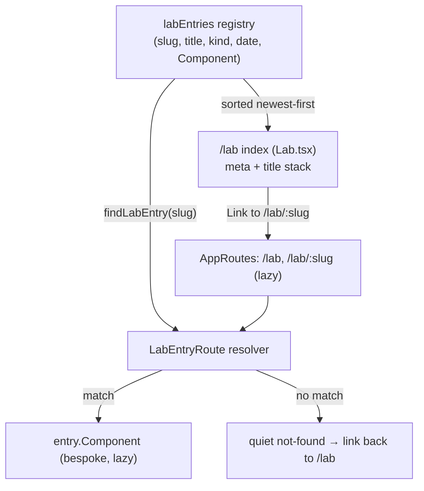

# feat: Lab section — registry-driven index of bespoke pages

## Summary

Add a new top-level `/lab` section: a quiet, `/writing`-style index that lists hand-built learning / case-study / experiment pages. A single in-code registry is the source of truth — each record carries the entry's metadata *and* its lazy-loaded page component, so one dynamic `/lab/:slug` route renders the bespoke page and a missing/renamed page is a build error. Each detail page is bespoke React with no shared template and no CMS (see origin: `docs/brainstorms/2026-06-26-lab-section-requirements.md`).

The plan builds bottom-up: an example entry page, then the typed registry, then the index page, then the route resolver and router wiring, then the nav link. Testing uses Vitest + React Testing Library, matching the existing `/writing` surface.

---

## Problem Frame

The portfolio has hand-built, technically distinctive pieces — an SVG constellation, a scroll-driven day journey, a Cloudflare-backed blog — but nowhere that presents them as learnings or case studies. They exist as ambient site features or live inside `/changelog`, so a visitor can't browse "things I built and what I learned" as a set.

`/writing` can't host them: it's a templated, CMS-backed (D1) blog for prose, rendered through three shared templates. These pieces are bespoke coded pages, not articles — forcing them through a markdown template would erase what makes each one worth showing. `/lab` is a sibling section whose only shared surface is the index; everything below it is hand-coded.

---

## Requirements Traceability

All requirements carry over from the origin document. Each maps to the unit(s) that satisfy it.

**Index page**
- R1. New `/lab` route + nav link — U4 (route), U5 (nav).
- R2. Writing-style minimal stack (meta line `year · kind`, dividers, gold hover, dark palette) — U3.
- R3. Rows link to entry pages; newest-first by date — U2 (ordering), U3 (render + links).
- R4. Quiet empty state when no entries — U3.

**Entry registry**
- R5. Typed in-code registry; no CMS/DB/admin — U2.
- R6. Each record provides title, slug, kind, date — U2 (extended with a lazy component ref per KTD1).

**Entry pages**
- R7. Bespoke React page per entry; no shared template — U1.
- R8. Entry pages live under `/lab/<slug>`, routed per entry — U4.
- R9. Entry pages stay off the landing/initial bundle (load only when visited) — U4 (lazy).

---

## Key Technical Decisions

- KTD1. **The registry is the single source of truth for both the index list and route resolution.** Each record carries its lazy page component alongside its metadata. This resolves the origin's two deferred questions — routing shape and dead-link safety — together: there is no separate route string to typo, and a missing or renamed page file fails the `import()` at build/type-check time rather than 404-ing at runtime. It goes one step beyond the "manual coupling accepted" call-out by removing the duplicate route declaration entirely (user-confirmed).
- KTD2. **One dynamic `/lab/:slug` route + a resolver component, not explicit per-entry `<Route>`s.** The resolver looks up the slug in the registry and renders that record's component. An unknown slug renders a quiet not-found in the page aesthetic with a link back to `/lab` (mirrors `/writing/:slug` missing-post handling).
- KTD3. **Synchronous in-code data → no loading/error states.** Unlike `/writing`, which fetches from D1 and handles loading/error/empty, `/lab` reads the registry synchronously. The index is strictly simpler: empty state only.
- KTD4. **Lazy-load the index and all entry pages**, mirroring the blog routes in `src/AppRoutes.tsx`, so bespoke (potentially heavy/interactive) pages never reach the landing bundle (R9).
- KTD5. **Registry fields stay minimal for v1** — slug, title, kind, date, component. No blurb or thumbnail (the chosen layout shows meta + title only); both are trivially addable later. Resolves the origin's deferred field-set question.

---

## High-Level Technical Design

The registry fans out to both surfaces; the router holds one dynamic route that delegates to the resolver.

The diagram is authoritative for the data flow; per-unit detail below governs file boundaries.

---

## Implementation Units

### U1. Example Lab entry page (bespoke scaffold)

- **Goal:** one minimal, fully bespoke `/lab` detail page that demonstrates the no-template freedom and gives the registry a real component to import. Clearly replaceable by real content later.
- **Requirements:** R7.
- **Dependencies:** none.
- **Files:** `src/pages/lab/entries/BuildingTheLab.tsx` (new).
- **Approach:** a self-contained dark-palette page (no shared template) wrapped in `PageTransition`, with a JetBrains Mono label (e.g. `fei.hu / lab / building the lab`) and freeform body content. Default export so it can be `lazy()`-imported by the registry. A self-referential first entry ("how this section was built") is a reasonable placeholder; the author replaces it.
- **Patterns to follow:** `src/pages/Work.tsx` (simple dark page, `PageTransition`, motion label, `ease = [0.16, 1, 0.3, 1]`); reduced-motion handling per project convention.
- **Test scenarios:** Test expectation: none — static presentational scaffold with no behavioral logic. Mount is covered indirectly by the route-resolution integration test in U4.

### U2. LabEntry type and entry registry (source of truth)

- **Goal:** a typed registry that is the single source of truth for the index list and route resolution.
- **Requirements:** R3 (ordering), R5, R6.
- **Dependencies:** U1 (registry imports the example component).
- **Files:** `src/types/index.ts` (add `LabKind`, `LabEntry`), `src/data/labEntries.ts` (new — registry array + `labEntriesByDate()` and `findLabEntry(slug)`).
- **Approach:** `LabKind = 'learning' | 'case-study' | 'experiment'` (extensible). `LabEntry = { slug; title; kind: LabKind; date: string /* ISO YYYY-MM-DD */; Component }`, where `Component` is a lazy-loaded component reference (the `lazy()` import of U1's page). The registry holds one record (the U1 example). `labEntriesByDate()` returns records sorted by `date` descending; `findLabEntry(slug)` returns the record or `undefined`. The index derives the display year and a human kind label from these fields.
- **Patterns to follow:** `BlogPostSummary` typing in `src/types/index.ts`; `lazy(() => import(...))` in `src/AppRoutes.tsx`.
- **Test scenarios** (`src/data/labEntries.test.ts`, new):
  - Happy path: `labEntriesByDate()` returns entries sorted newest-first given multiple dates.
  - `findLabEntry('building-the-lab')` returns the example record.
  - Edge: `findLabEntry('does-not-exist')` returns `undefined`.
  - Invariant: every registry record has a unique slug.

### U3. Lab index page

- **Goal:** `/lab` renders entries as the Writing-style minimal stack; shows a quiet empty state when the registry is empty.
- **Requirements:** R2, R3, R4.
- **Dependencies:** U2.
- **Files:** `src/pages/Lab.tsx` (new), `src/pages/Lab.test.tsx` (new).
- **Approach:** mirror `src/pages/Writing.tsx` structure — `PageTransition`, dark `Page`/`Column`, mono `Label` (`fei.hu / lab`), a vertical `List` of rows where each row is a meta line (`YEAR · Kind`) above the title, thin dividers between rows, gold hover on the title. Map over `labEntriesByDate()`; each row is a `Link` to `/lab/${slug}`. No data fetch and no loading/error states (KTD3) — strictly simpler than Writing. Empty registry → an empty-state line mirroring Writing's "No posts yet." (e.g. "No entries yet."). Gate the entrance animation on `useReducedMotion` per project convention (as `src/components/Layout/Header.tsx` does — `Writing.tsx` animates its entrance but does not itself gate on reduced motion, so follow the convention, not that file verbatim).
- **Patterns to follow:** `src/pages/Writing.tsx` (styled-components, motion entrance, `ease` constant, meta-line + title rows, gold hover `#fcd34d`).
- **Test scenarios** (`src/pages/Lab.test.tsx`):
  - Happy path: renders one row per registry entry, each showing title and a meta line with the year and kind label.
  - Ordering: rows appear newest-first.
  - Links: each row links to `/lab/<slug>`.
  - Edge (empty): with an empty registry, renders the empty-state copy and no list rows.

### U4. Lab entry route resolver + router wiring

- **Goal:** a single dynamic `/lab/:slug` route that resolves the bespoke component from the registry; unknown slug renders a quiet not-found. Register `/lab` and `/lab/:slug`, both lazy.
- **Requirements:** R1 (route), R8, R9.
- **Dependencies:** U2, U3.
- **Files:** `src/pages/lab/LabEntryRoute.tsx` (new), `src/pages/lab/LabEntryRoute.test.tsx` (new), `src/AppRoutes.tsx` (add routes).
- **Approach:** `LabEntryRoute` reads `useParams<{ slug: string }>()`, calls `findLabEntry(slug)`, and renders `<entry.Component />` on a match (the app-level `<Suspense>` in `AppRoutes` already covers the lazy boundary) or a minimal not-found block (dark aesthetic, link back to `/lab`) on a miss. In `src/AppRoutes.tsx`, add `Lab` and `LabEntryRoute` as `lazy()` imports and register `/lab` before `/lab/:slug` (exact route precedes param route). Lazy imports keep both off the landing bundle (R9).
- **Patterns to follow:** `src/pages/WritingPost.tsx` (`useParams` slug + missing-record handling); `src/AppRoutes.tsx` lazy imports and the route-ordering precedent (`/writing/:slug` is registered after the more specific `/writing/admin/*` routes).
- **Test scenarios** (`src/pages/lab/LabEntryRoute.test.tsx`):
  - Happy path: a known slug renders that entry's component.
  - Error path: an unknown slug renders the not-found block with a link to `/lab`.
  - Integration: navigating to `/lab/building-the-lab` mounts the example page (proves registry → route → bespoke page wiring end-to-end).
- **Verification:** `/lab` lists the example; clicking it lands on the bespoke page; `/lab/<unknown>` shows not-found; the landing route's bundle is unaffected (lazy).

### U5. Add Lab to the global nav

- **Goal:** a "Lab" link in the header between Changelog and Work, with active state and the sliding underline.
- **Requirements:** R1 (nav link).
- **Dependencies:** U4 (route exists).
- **Files:** `src/components/Layout/Header.tsx`.
- **Approach:** add `isLab = pathname === '/lab' || pathname.startsWith('/lab/')`; insert a `NavItem` with `NavLink to="/lab"` and `ActiveUnderline show={isLab}` between the Changelog and Work items, mirroring the existing items exactly.
- **Patterns to follow:** the existing `NavItem`/`NavLink`/`ActiveUnderline` items in `src/components/Layout/Header.tsx`.
- **Test scenarios:** at pathname `/lab`, the Lab link carries active state and sits between Changelog and Work. (If no Header test file exists, add a focused render test for this; keep it light — the active-state logic is the only behavior.)

---

## Scope Boundaries

Carried from the origin document:

- No CMS, database, admin UI, or shared rendering template for lab pages — bespoke-per-page is the point.
- No index filtering, tags, or search.
- No blurb/excerpt or thumbnails on index rows.
- Not reshaping `/writing` or building out `/work`.

### Deferred to Follow-Up Work

- Real lab content entries beyond the single example (author-provided).
- Richer index affordances (blurb, tags, grouping) if the list grows — the registry shape extends cleanly.

---

## Open Questions (deferred to implementation)

- Exact copy and content of the example entry (U1) — author's to fill; the scaffold only needs to prove the wiring.
- Final component/file names are suggestions; the implementer may adjust as long as the registry imports resolve.

---

## Sources & Research

- `src/pages/Writing.tsx` — the list pattern to mirror in U3 (meta line + title stack, dividers, gold hover, empty state, motion entrance).
- `src/pages/WritingPost.tsx` — `useParams` slug lookup and missing-record handling, mirrored by U4's resolver.
- `src/AppRoutes.tsx` — `lazy()` route registration and exact-before-param route ordering.
- `src/components/Layout/Header.tsx` — nav items, active state, and the shared-layout `ActiveUnderline`; insertion point for U5.
- `src/pages/Work.tsx` — minimal dark-palette page with `PageTransition`, the model for U1's bespoke scaffold.
- `src/types/index.ts` — `BlogPostSummary` typing convention for the new `LabEntry` type.
