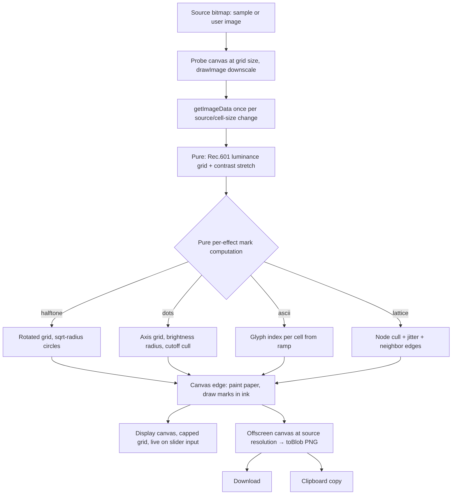

# Dither Lab Entry - Plan

> **Shipped, and overtaken in places (noted 2026-08-20).** The entry is live at `/lab/dither`.
> This plan stays as the record of why the shape was chosen — the CORS probe behind bundling
> the sample rather than hotlinking `media.fei.io` (KTD5), the cost-scales-with-cell-count model
> (KTD1) that two code comments still cite — but where it disagrees with the code, the code is
> right. Known drift:
>
> - **KD8 / KTD5, the default photo.** One bundled sample (`lab-hand.webp`) became two, chosen
>   per effect: a wide city for halftone and dots, a neon portrait for ascii and lattice.
>   `lab-hand.webp` is deleted.
> - **R6's dropzone.** A photo the visitor loads now retires the samples for the visit; effects
>   stop swapping the image under them.
> - **KTD2's column cap.** 120 became 256, with a coarser cap while a control is dragged, after
>   the cap was found to silently override the cell-size slider below a 17px cell.
> - **Defaults and duotone.** Ascii opens at a 16px cell, lattice at 44 columns; the duotone list
>   grew to 11; ground and mark are chosen by luminance rather than by slot.
> - **Beyond the contract.** A photo layer (the photograph as the ground, with blend modes and
>   layer opacity), a per-effect description card, and per-page schema.org metadata all postdate
>   this plan.

## Goal Capsule

- **Objective:** `/lab/dither` exists: a client-side image tool where a visitor drops in a photo, scrubs per-effect sliders across four effects (halftone, dots, ASCII, lattice), and takes away a full-resolution duotone PNG.
- **Means:** Main-thread Canvas 2D with a probe-downscale pipeline (KTD1), rendered as a bespoke lab entry per the repo's entry conventions.
- **Authority:** This plan's Product Contract governs behavior; Key Technical Decisions govern mechanism; repo conventions (CLAUDE.md, existing `src/pages/lab/entries/` patterns) govern style.
- **Stop conditions:** Stop and surface if the settled Canvas 2D approach cannot hold interactive slider feedback on a typical photo even with the probe cap (KTD2), or if clipboard/PNG export is unachievable on a supported browser without a backend.
- **Tail ownership:** All units land in one PR; no phased rollout.

---

## Product Contract

### Summary

Add a new lab entry at `/lab/dither`: an image-effect tool rendering four cell-sampled effects — halftone, dots, ASCII, lattice — over a user-supplied photo, with per-effect native controls and a duotone ink/paper color system. Everything runs in the browser; output is a full-resolution PNG via download or clipboard. A bundled pet photo preloads so the page opens already rendering.

### Problem Frame

The lab is the portfolio's space for interactive experiments. Ditther.com proves this tool category works entirely client-side, but its app is a 50-effect layered editor; this entry is the deliberately smaller version: four effects, honest controls, one strong duotone look. Requirements were settled in full with the user in the invoking session (effects, scope, rendering approach, color model, chrome, inputs, outputs, mobile posture).

### Key Decisions

- KD1. **Fully client-side; images never leave the browser.** No R2/D1/API surface. (session-settled: user-approved — chosen over any backend involvement: privacy is a free feature and the entry stays self-contained.) Governs R9.
- KD2. **All four effects ship in v1.** (session-settled: user-approved — chosen over a smaller subset: they share one per-cell sampling core, so marginal cost after the first is low.) Governs R1–R4.
- KD3. **Per-effect native controls, not one shared slider set.** (session-settled: user-directed — chosen over a minimal shared set and over presets-first: the user picked option (b) explicitly.) Governs R1–R4.
- KD4. **Duotone ink/paper pickers; not bound to the site token system; plus an image-colors toggle.** (session-settled: user-directed — chosen over locked site-ramp monochrome: the tool is treated as an individual app. Source-color rendering was first deferred, then directed back in during dev review after comparing renders against the reference app.) Governs R5.
- KD5. **PNG download + clipboard copy only; no SVG export.** (session-settled: user-approved — chosen over adding SVG: a second renderer to maintain, and ditther.com ships none either.) Governs R8.
- KD6. **Mobile-usable.** Unlike the landing lenses, nothing here needs hover; phone photos are the natural input. (session-settled: user-approved — chosen over desktop-only.) Governs R10.
- KD7. **Quiet dark lab-entry chrome; the canvas is the loud part.** (session-settled: user-approved — chosen over a bespoke app-chrome design.) Governs R11.
- KD8. **Default sample image is the lab-hand photo.** (session-settled: user-directed — the user supplied `https://media.fei.io/lab/prompted/lab-hand.webp`, replacing their earlier bluebonnet pick during dev review.) Governs R6.

### Requirements

**Effects and controls**

- R1. Halftone: circle dots on a rotatable grid, radius from sqrt of cell luminance so perceived tone is linear in dot area. Controls: Cell size, Angle (0–180°, default 45°), Contrast, Invert (dark-grows vs light-grows).
- R2. Dots: flat marks on an axis-aligned grid, grown by brightness. Controls: Cell size, Fill cutoff (luminance threshold below which no dot draws), Contrast.
- R3. ASCII: per-cell luminance indexed into a density-ordered glyph ramp, drawn in JetBrains Mono at uniform glyph size. Controls: Cell size, Contrast, Charset — preset ramps (Classic ` .,;:+=*%S#@`, Blocky, Thin/dots) plus a free custom-string input.
- R4. Lattice: node grid with a luminance cull, jittered node positions, solid thin strokes connecting surviving neighbors, node marks on top. Controls: Node density, Threshold, Jitter.
- R5. All effects render in the active duotone: an Ink picker and a Paper picker, defaulting to a punchy non-site pair, with curated preset pairs offered. An "image colors" toggle paints marks with the sampled pixel's color instead of the ink; paper stays the ground.

**Input**

- R6. The page loads with the bundled lab-hand sample already rendered — never an empty dropzone.
- R7. A visitor can replace the image via file picker, drag-and-drop onto the page, or paste from the clipboard.

**Output**

- R8. Export as PNG download and copy-to-clipboard. The exported PNG re-renders at the source image's full resolution, not the preview cap — up to a documented safe canvas limit, above which it scales down proportionally.

**Platform and page**

- R9. All processing is in-browser; no image bytes are sent anywhere.
- R10. The tool is fully usable on touch devices: controls operate without hover, layout works at phone widths, camera-roll upload works. The site's existing mobile notice mechanism is left untouched.
- R11. The page is a standard bespoke lab entry: `PageTransition` wrapper, `usePageTitle`, `← lab` breadcrumb, `var(--n-11)` ground, registered in the lab registry with SEO meta.

### Scope Boundaries

**Deferred to Follow-Up Work**

- Video input and animated export.
- SVG export.
- Additional effects (Bayer/Floyd–Steinberg dithering, shape mosaics), preset "Looks", and effect stacking.
- Any change to the site-wide mobile notice (flag separately if it overlays this entry intrusively).

**Outside this product's identity**

- Accounts, watermarks, Pro gating, or any monetization mechanics from the reference app.
- A layer/editor model — this is one image, one effect, one look at a time.

---

## Planning Contract

### Key Technical Decisions

- KTD1. **Main-thread Canvas 2D with a probe-downscale pipeline.** Downscale the source into a probe canvas sized to the cell grid, `getImageData` (with `willReadFrequently: true`) once per source-or-cell-size change, compute Rec.601 luminance per cell, draw marks on the output canvas. Cost scales with cell count, not pixel count. (session-settled: user-approved — chosen over a module worker and over WebGL: research on ditther.com's shipped bundle showed 2D-canvas loops handle real-time slider feedback for all four effects; the repo's `blobMapWorker` pattern stays in reserve if profiling disagrees.) Governs the mechanism for R1–R4.
- KTD2. **Preview capped, export full-res.** The on-screen canvas renders at display size with the grid capped (~120 columns); slider input re-renders live. Export runs the same pure pipeline against the source's full resolution into an offscreen canvas, then `toBlob('image/png')` — clamped to a documented safe pixel budget (area ≤16M px, aspect preserved, scaling down proportionally when the source exceeds it), because iOS Safari silently blanks canvases past ~16.7M pixels and current iPhones shoot 24–48MP. A null `toBlob` result is a surfaced failure through the same inline notice as bad inputs. (session-settled: user-approved — the proven shape from the reference app; it is what makes KTD1 safe.) Governs R8.
- KTD3. **Pure math in a tested sibling module; canvas calls at the edges.** The luminance grid, contrast stretch, per-effect mark computation (positions, radii, glyph indices, culls, edges) are pure functions over typed arrays and plain data — no DOM — unit-tested in a sibling `.test.ts`. Canvas/decode/export code is thin and untested, per the repo's `asciiSample.ts` convention ("the mapping is pure because it is the part that can be wrong in ways you cannot see"). jsdom has no canvas, so guard canvas paths in components (`Lab.tsx:85` pattern).
- KTD4. **Jitter takes an injected random source, seeded in production too.** Lattice's node scatter receives a `rand: () => number` parameter so tests seed it deterministically. The page holds a jitter seed (rerolled only when jitter-relevant params change) and passes a seeded PRNG built from it to both preview and export renders, so unrelated re-renders (duotone, contrast) and the full-res export reproduce the identical scatter — the DoD's "exported PNG matches the preview" depends on this.
- KTD5. **Bundle the default sample locally instead of hotlinking media.fei.io.** `media.fei.io` sends `access-control-allow-origin: https://fei.io` only — a hotlinked copy taints the canvas on localhost and previews, breaking export. Bundle a 1200px-wide downscaled webp copy at `public/lab/dither/lab-hand.webp` and load same-origin (the effect samples at most 120 columns, so full resolution buys nothing on load). (Decision made during planning from a verified CORS probe; the user chose the image, not the delivery path.)
- KTD6. **Decode via `createImageBitmap` from the picked/dropped/pasted `Blob`,** falling back to an `HTMLImageElement` + object URL where unsupported. Revoke object URLs and close bitmaps when a new source replaces them.

### High-Level Technical Design

The pure layer (LUMA, MARKS) is one module consumed identically by preview and export — only the target resolution and grid cap differ. The rotated halftone grid is handled in mark computation (rotate sample coordinates about the canvas center and over-scan the diagonal), so the canvas edge stays a dumb mark-painter.

### Assumptions

- Interactive-rate re-render at a ≤120-column grid holds on a mid-range phone; the reference app sustains this budget with more overhead. If it doesn't, throttle slider re-render to rAF before reaching for the worker.
- `ClipboardItem` PNG write is available on current Chrome/Safari; Firefox may need the copy button hidden or a fallback message. Exact handling is an implementation-time detail.

---

## Implementation Units

### U1. Pure transform core

- **Goal:** All effect math exists as tested pure functions.
- **Requirements:** R1–R5 (math halves), KTD3, KTD4.
- **Dependencies:** none.
- **Files:** `src/pages/lab/entries/ditherCore.ts` (new), `src/pages/lab/entries/ditherCore.test.ts` (new).
- **Approach:**
  - Types: `EffectId`, per-effect param interfaces, `Duotone { ink, paper }`, a `Grid { cols, rows, luma: Float32Array }`.
  - `lumaGrid(data, w, h, cols, rows)` — pure over an `ImageData`-shaped `{ data, width, height }`, Rec.601 weights.
  - `stretchContrast(luma, contrast)` — the reference app's `(l - 0.5) * (1 + c) + 0.5` clamp shape.
  - Per-effect mark functions returning plain arrays: halftone `{x, y, r}` on a rotated grid with sqrt-radius and a skip under 5% of cell radius; dots with fill-cutoff cull; ascii `{col, row, char}` from ramp indexing (spaces skipped); lattice `{nodes, edges}` with threshold cull and injected-`rand` jitter.
  - Charset ramps exported as named constants; custom charset accepted as a plain string.
- **Patterns to follow:** `src/pages/lab/entries/asciiSample.ts` + its test (pure math, doc-comment voice); `src/data/labEntries.ts` for the pure-helper style.
- **Test scenarios:**
  - Luminance: a known 2×2 RGBA fixture yields the exact Rec.601 values; all-black → 0, all-white → 1.
  - Contrast: contrast 0 is identity; high contrast pushes 0.4/0.6 apart symmetrically; results clamp to [0, 1].
  - Halftone: white cell (invert off) yields radius ≈ 0 and is skipped; black cell yields max radius; radius follows sqrt (luma 0.75 → half the radius, i.e. a quarter of the area, of luma 0); Invert swaps the mapping; angle 0 vs 45° both produce marks covering all four corners of the frame (over-scan works).
  - Dots: cell below the fill cutoff produces no mark; brightness ordering of radii is monotonic.
  - ASCII: luma 0 maps to the ramp's densest glyph and luma 1 to its lightest; a space in the ramp produces no mark; a 1-character custom ramp doesn't divide by zero.
  - Lattice: nodes below threshold are culled and their edges with them; jitter with a seeded `rand` is reproducible; jitter 0 leaves nodes on exact grid centers; no edge references a culled node.
- **Verification:** `npm run test:run` passes with the new suite; module imports no DOM globals.

### U2. Canvas pipeline (preview + export renderer)

- **Goal:** One thin canvas edge renders any effect at any target resolution from the pure core.
- **Requirements:** R1–R5 (paint halves), R8, KTD1, KTD2.
- **Dependencies:** U1.
- **Files:** `src/pages/lab/entries/ditherCanvas.ts` (new).
- **Approach:**
  - `renderEffect(target, source, effect, params, duotone, gridCap)` — probe-downscale the source, call U1, paint paper fill then ink marks. Batch same-fill circles into one `beginPath`; ASCII sets font once (`JetBrains Mono` at cell size) and `fillText`s per cell; the first ASCII render gates on a guarded `document.fonts.load` check (the `PickAFont.tsx` / `Lab.tsx` pattern) and re-renders once resolved, so a cold load never freezes fallback glyphs.
  - Preview path: display-sized canvas, grid capped (~120 columns), re-invoked per input event.
  - Export path: same function against an offscreen canvas at source resolution with the cap scaled proportionally so the exported look matches the preview (same cell count, larger cells).
  - Cache the probe `ImageData` keyed on (source, cols, rows) so slider moves that don't change the grid skip `getImageData`.
- **Patterns to follow:** `src/components/Landing/lensMath.ts` `rasterBlobMap` (raster at the edge, math elsewhere); `asciiSample.ts:146-172`'s "not pure, not tested — it is a canvas call" framing.
- **Test scenarios:** Test expectation: none — this module is the canvas edge; jsdom has no 2d context (repo convention: guard and leave untested; the logic it exercises is covered in U1).
- **Verification:** In the dev server, all four effects render the sample image and slider drags re-render without visible jank.

### U3. Entry page: layout, controls, default sample

- **Goal:** The `/lab/dither` page exists with effect tabs, per-effect sliders, duotone pickers, and the sample photo rendering on load.
- **Requirements:** R1–R6, R10, R11, KD7.
- **Dependencies:** U1, U2.
- **Files:** `src/pages/lab/entries/Dither.tsx` (new), `public/lab/dither/lab-hand.webp` (new — copied from media.fei.io per KTD5).
- **Approach:**
  - Page shell per entry convention: `PageTransition`, `usePageTitle('Dither')`, `<Crumb to="/lab">`, `background: var(--n-11)`, styled-components with theme accessors for chrome; the duotone pickers hold their own state outside the token system per KD4.
  - Effect switcher (4 tabs/pills) shows only the active effect's controls; params held per-effect so switching back restores them.
  - Sliders as `<input type="range">` (native touch support), each with a visible label or `aria-label` following `PickAFont.tsx`'s per-slider pattern; charset presets as buttons + a text input, duotone as two `<input type="color">` plus curated pair swatches.
  - Layout: canvas dominant, controls in a column beside it on wide screens and below it at phone widths (plain CSS, `theme.breakpoints` literals).
  - Load the bundled sample on mount via KTD5; render immediately.
  - Guard all canvas work behind a context-existence check so jsdom render tests pass.
- **Patterns to follow:** `src/pages/lab/entries/PickAFont.tsx` (slider-driven entry, jsdom guards at :46, breadcrumb + EndLink shape); `Prompted.tsx` page body for shell structure.
- **Test scenarios:**
  - The page renders in jsdom without throwing (canvas guarded) and shows the four effect names.
  - Switching effect tabs swaps the visible control set (halftone shows Angle; lattice shows Jitter).
  - Param state persists across an effect switch and back.
- **Verification:** Page loads at `/lab/dither` in dev with the lab-hand sample rendered in the default effect and duotone.

### U4. Image input: picker, drag-and-drop, paste

- **Goal:** A visitor can replace the sample with their own photo three ways.
- **Requirements:** R7, R9, KTD6.
- **Dependencies:** U3.
- **Files:** `src/pages/lab/entries/Dither.tsx` (modify).
- **Approach:**
  - Hidden `<input type="file" accept="image/*">` behind a visible button (camera roll on mobile).
  - `dragover`/`drop` on the page container with a visible drop-affordance state; `paste` listener on the document scoped to the page's lifetime.
  - All three funnel into one `loadSource(blob)` that decodes (KTD6), swaps state, releases the previous bitmap/URL, and re-renders. The previous bitmap is released only after a successful decode.
  - Reject non-image blobs silently except a brief inline notice. A decode rejection (`createImageBitmap` reject — e.g. HEIC on Chrome — or fallback image `onerror`) keeps the current source and routes into the same inline notice.
- **Patterns to follow:** First upload surface in the repo — no precedent to mirror; follow `Prompted.tsx`'s event-listener add/remove hygiene.
- **Test scenarios:**
  - `loadSource` with a non-image blob leaves the current source in place and surfaces the notice.
  - `loadSource` with an image-typed blob that fails decode leaves the current source in place and surfaces the notice.
  - Listeners are removed on unmount (no paste handling after leaving the page).
  - Test expectation for decode itself: none — `createImageBitmap` is a browser edge jsdom lacks.
- **Verification:** In dev, each of file-pick, drag-drop, and paste replaces the image and re-renders; leaving the route detaches the paste listener.

### U5. Export: PNG download + clipboard copy

- **Goal:** The current effect at full source resolution leaves the page as a PNG.
- **Requirements:** R8, KTD2.
- **Dependencies:** U2, U3.
- **Files:** `src/pages/lab/entries/Dither.tsx` (modify), `src/pages/lab/entries/ditherCanvas.ts` (modify if the export helper lives there).
- **Approach:**
  - Download: render export canvas (clamped per KTD2's pixel budget) → `toBlob('image/png')` → object URL → temporary `<a download="dither.png">` click → revoke. A null `toBlob` result surfaces through the inline notice.
  - Copy: `navigator.clipboard.write([new ClipboardItem({'image/png': blobPromise})])` — pass the promise directly (Safari requires it); hide or disable the copy button when `ClipboardItem` is absent, with download as the universal path.
  - Both buttons disabled while an export render is in flight.
- **Test scenarios:**
  - Copy control is not rendered/enabled when `ClipboardItem` is undefined (assertable in jsdom).
  - Export filename and MIME are `dither.png` / `image/png` (via a seam that returns the blob + name, testable without canvas by injecting a fake renderer).
- **Verification:** In dev, downloaded PNG opens at the source image's full pixel dimensions with the on-screen look; copy pastes into an image-accepting target on Chrome and Safari.

### U6. Registration, SEO meta, and final checks

- **Goal:** The entry is discoverable and the repo's gates pass.
- **Requirements:** R11.
- **Dependencies:** U3 (page must exist for the lazy import).
- **Files:** `src/data/labEntries.ts` (modify), `functions/lab/[slug].ts` (modify).
- **Approach:**
  - Registry entry: `slug: 'dither'`, `title` in the lab's lowercase editorial voice (final copy at implementation), `kind: 'experiment'`, `date` = ship date, `Component: lazy(() => import('../pages/lab/entries/Dither'))`.
  - `LAB_META['dither']` title/description matching the component's `usePageTitle` string.
  - Leave `public/sitemap.xml` alone (consistent with existing entries).
  - Confirm the heavy modules are imported only from `Dither.tsx`, never `labEntries.ts`, so the chunk splits (check `dist/assets/` for a `Dither-*.js`).
- **Test scenarios:**
  - Registry: `findLabEntry('dither')` resolves; `orderForIndex` places the entry among dated work above galleries (extend the existing registry test if one covers ordering; otherwise cover via `labEntries` fixture).
- **Verification:** `/lab` lists the entry; `/lab/dither` resolves; `npm run build` emits a separate `Dither` chunk.

---

## Verification Contract

| Gate | Command | Applies to |
|---|---|---|
| Types (app + functions) | `npx tsc -b` | all units |
| Lint | `npm run lint` | all units |
| Unit tests | `npm run test:run` | U1 (core suite), U3–U6 (component/registry tests) |
| Production build + chunk split | `npm run build`, then confirm `dist/assets/Dither-*.js` exists | U6 |
| Manual: interactive feel | `npm run dev`, scrub every slider on every effect with the sample image | U2, U3 |
| Manual: touch | DevTools device emulation (`390x844x3,mobile,touch`) — controls and upload usable | U3, U4 |
| Manual: export fidelity | Download + clipboard on Chrome and Safari; PNG at full source resolution, including a ≥24MP photo on iOS Safari exercising the clamp | U5 |

jsdom has no canvas 2d context and no `document.fonts`; component tests guard those paths rather than mocking them (repo convention).

---

## Definition of Done

- All six units complete; every gate in the Verification Contract passes.
- R1–R11 each traceable to shipped behavior on `/lab/dither`.
- The exported PNG matches the preview's look at the source image's full resolution.
- The page is fully operable with touch input at phone widths.
- No image bytes leave the browser (network panel shows no uploads).
- No dead experimental code from abandoned approaches remains in the diff.

---

## Deferred / Open Questions

### From 2026-08-19 review

- **Document-level paste listener can hijack charset text input** — U4 — image input (paste) (P1, design-lens, confidence 75)

  Pasting a custom glyph ramp into the ASCII charset text field can be swallowed by the page's image-paste handler instead of landing as text. The plan commits to both a free text input and a document-scoped paste listener without saying how they coexist — the implementer should either ignore paste events when a text field has focus, or treat only pastes whose clipboard payload is an image file as image input.

- **Effect switcher's interaction pattern (tabs vs. pills) unresolved** — U3 — effect switcher (P2, design-lens, confidence 75)

  An implementer may ship plain unstyled buttons with no selected-state semantics for assistive tech, because "tabs/pills" names two different accessible patterns. The repo precedent is the font-pairing entry's single-select row, which uses radiogroup semantics; tablist with arrow-key navigation is the alternative.

---

## Sources & Research

- Reference app research: ditther.com's shipped bundle (`app.ditther.com`, `main-BvUCYY2z.js`) read directly during planning — Canvas 2D loops for all grid effects, shared probe-downscale pipeline, per-effect frame budgets, sqrt-luminance halftone radii, ramp-indexed ASCII, threshold-culled jittered lattice. These findings settled KTD1/KTD2 and the R1–R4 algorithms.
- Repo conventions: `src/pages/lab/entries/asciiSample.ts` (pure-math/canvas-edge split), `src/pages/lab/entries/PickAFont.tsx` (slider entry, jsdom guards), `src/data/labEntries.ts:4-6` (lazy-import chunk discipline), `src/components/Landing/blobMapWorker.ts` + `lensEngine.ts:616-644` (worker fallback pattern, held in reserve).
- CORS probe (2026-08-19): `media.fei.io` returns `access-control-allow-origin: https://fei.io` only → KTD5 bundles the sample locally.
